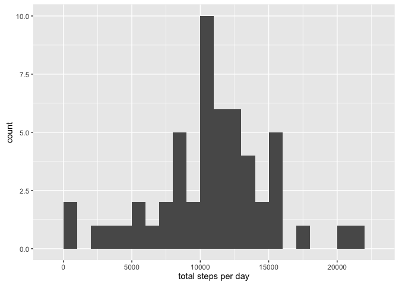
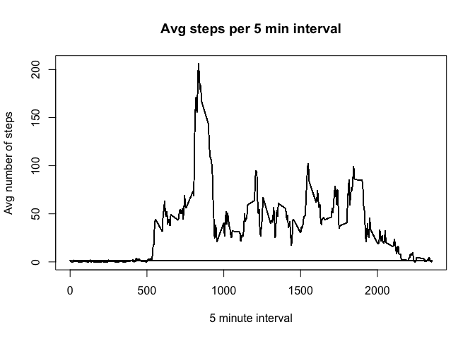
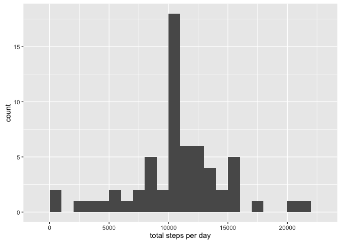
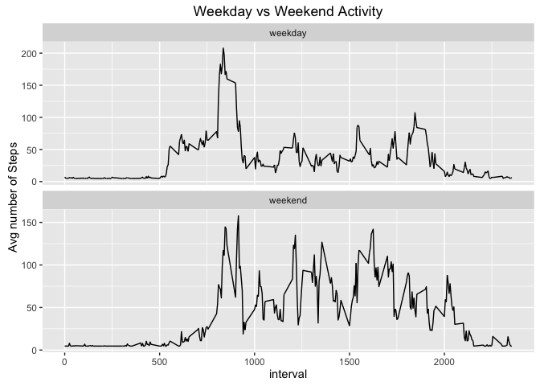

# Reproducible Research: Peer Assessment 1

## Loading and preprocessing the data

```r
library(ggplot2)
library(tidyr)
library(dplyr)
```

```
## 
## Attaching package: 'dplyr'
```

```
## The following objects are masked from 'package:stats':
## 
##     filter, lag
```

```
## The following objects are masked from 'package:base':
## 
##     intersect, setdiff, setequal, union
```

```r
library(lubridate)

setwd("~/Desktop")
data <- read.csv("activity.csv", header=TRUE)
data$date <- as.Date(data$date, "%Y-%m-%d")
```


## What is mean total number of steps taken per day?

```r
total_steps_by_day <- data %>%
    filter(!is.na(steps)) %>%
    group_by(date) %>%
    summarise(Total = sum(steps))

qplot(total_steps_by_day$Total, binwidth = 1000, xlab="total steps per day", geom="histogram")
```

<!-- -->

```r
## What is the mean of the total number of steps per day?
mean_steps_per_day <- mean(total_steps_by_day$Total)
mean_steps_per_day
```

```
## [1] 10766.19
```

```r
## What is the median of the total number of steps per day?
median_steps_per_day <- median(total_steps_by_day$Total)
median_steps_per_day
```

```
## [1] 10765
```

## What is the average daily activity pattern?

```r
steps_per_interval <- data %>%
    filter(!is.na(steps)) %>%
    group_by(interval) %>%
    mutate(mean = mean(steps))

plot(steps_per_interval$interval, steps_per_interval$mean, type="l", xlab="5 minute interval", ylab="Avg number of steps", main="Avg steps per 5 min interval")
```

<!-- -->

```r
## Which 5 minute interval, on average across all days, contains the max number of steps?
max_steps <- data$interval[which.max(steps_per_interval$mean)]
max_steps
```

```
## [1] 835
```


## Imputing missing values

```r
total_missing_values <- sum(is.na(data))
total_missing_values
```

```
## [1] 2304
```

```r
## create new data with the missing values replaced with the mean of the steps
updated_data <- data
updated_data$steps[is.na(updated_data$steps)] <- mean(data$steps, na.rm=TRUE)

updated_total_steps_by_day <- updated_data %>%
    group_by(date) %>%
    summarise(Total = sum(steps))

qplot(updated_total_steps_by_day$Total, binwidth = 1000, xlab="total steps per day", geom="histogram")
```

<!-- -->

```r
## What is the mean of the total number of steps per day?
updated_mean_steps_per_day <- mean(updated_total_steps_by_day$Total)
updated_mean_steps_per_day
```

```
## [1] 10766.19
```

```r
## What is the median of the total number of steps per day?
updated_median_steps_per_day <- median(updated_total_steps_by_day$Total)
updated_median_steps_per_day
```

```
## [1] 10766.19
```


## Are there differences in activity patterns between weekdays and weekends?

```r
#create new column identifying day of week
updated_data$weekend_or_weekday <- weekdays(updated_data$date)

## assign weekend or weekday 
updated_data$weekend_or_weekday[grepl("S(aturday|unday)", updated_data$weekend_or_weekday)] <- "weekend"
updated_data$weekend_or_weekday[grepl("day", updated_data$weekend_or_weekday)] <- "weekday"

## get average steps for weekend and weekend
steps_weekend <- updated_data %>%
    filter(weekend_or_weekday == "weekend") %>%
    group_by(interval) %>%
    mutate(mean = mean(steps))

steps_weekday <- updated_data %>%
    filter(weekend_or_weekday == "weekday") %>%
    group_by(interval) %>%
    mutate(mean = mean(steps))

combined_steps <- rbind(steps_weekday, steps_weekend)

## plot both weekend and weekday for comparison
print(ggplot(combined_steps, aes(x=interval, y=mean)) %>%
        + geom_line() %>% 
        + xlab("interval") %>%
        + ylab("Avg number of Steps") %>%
        + facet_wrap(~weekend_or_weekday, scales = "free_y", ncol = 1) %>% 
        + ggtitle("Weekday vs Weekend Activity"))
```

<!-- -->

